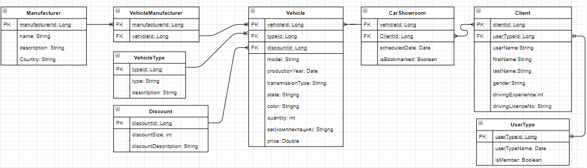

# Car-Showroom

## Short description
This is a project for managing simple car showroom system. The application is capable of providing for an end user opportunity to observe  car information, make a reservasion for a test drive and purchase of a vehicle with discount

## Used technologies and libraries
1. Spring DataJpa for interaction with database
2. MySQL as a database system
3. Spirng REST
4. Spring security and JWT
5. Project lombok
6. Swagger 2 documentation

## Entities 
#### This project includes 3 main entities for interaction with each other
1. Manufacturer
2. Vehcle
3. Client
#### 3 supporting entities for describing some specific features of these entites
1. Vehicle type
2. Discount
3. UserType
#### And 2 connecting entities 
1. VehicleManufacturer
2. CarShowroom
## Entity relationships

